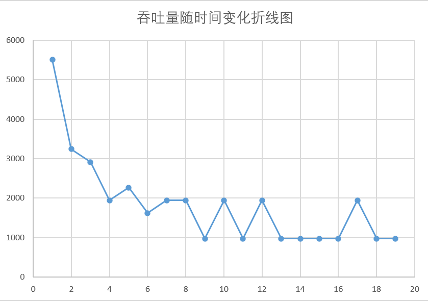

# LSM-KV 项目报告模板

章三 522xxxxxxxxx
2024 年 X 月 X 日

## 1 背景介绍

LSM Tree (Log-structured Merge Tree) 是一种可以高性能执行大量写操作
的数据结构。它于 1996 年，在 Patrick O'Neil 等人的一篇论文中被提出。现
在，这种数据结构已经广泛应用于数据存储中。Google 的 LevelDB 和
Facebook 的 RocksDB 都以 LSM Tree 为核心数据结构。2016 年，Lanyue Lu
等人发表的论文 Wisckey 针对 LSM Tree 长期被人诟病的写放大（Write
Amplification）问题提出了相应优化：键值分离。在过去几年中，工业界
中也陆续涌现出键值分离的 LSM Tree 存储引擎，例如 TerarkDB、Titan 等。
在本项目中，我基于 LSM Tree 以及键值分离技术开发一个键值存
储系统。该键值存储系统将支持下列基本操作，并支持持久化、垃圾回收
等存储系统特性（其中 Key 是 64 位无符号整数，Value 为字符串）。

- **PUT(Key, Value)**: 设置键 Key 的值为 Value。
- **GET(Key)**: 读取键 Key 的值。
- **DEL(Key)**: 删除键 Key 及其值。
- **SCAN(Key1, Key2)**: 读取键 Key 在[Key1, Key2]区间内的键值对。

## 2 测试

此部分主要是展现实现的项目的测试，主要分为下面几个子部分。

### 2.1 性能测试

#### 2.1.1 预期结果

Put、Delete 这些涉及硬盘的以及 Compaction 的操作延迟会较大。

#### 2.1.2 常规分析

1. Get、Put、Delete、Scan 操作的延迟

| Value Size | Put         | Get          | Delete       | Scan        |
| ---------- | ----------- | ------------ | ------------ | ----------- |
| 1 kb       | 0.146566 ms | 0.0303734 ms | 0.0714264 ms | 0.878925 ms |
| 2 kb       | 0.228369 ms | 0.0539763 ms | 0.128436 ms  | 0.866267 ms |
| 4 kb       | 0.362416 ms | 0.0546692 ms | 0.125943 ms  | 0.905369 ms |
| 8 kb       | 0.701531 ms | 0.142676 ms  | 0.182356 ms  | 0.885494 ms |
| 16 kb      | 1.26382 ms  | 0.196232 ms  | 0.299474 ms  | 1.03196 ms  |

2. Get、Put、Delete、Scan 操作的吞吐

| Value Size | Put  | Get   | Delete | Scan |
| ---------- | ---- | ----- | ------ | ---- |
| 1 kb       | 6822 | 32923 | 14000  | 1137 |
| 2 kb       | 4378 | 18526 | 7785   | 1154 |
| 4 kb       | 2759 | 18291 | 7940   | 1104 |
| 8 kb       | 1425 | 7008  | 5483   | 1129 |
| 16 kb      | 791  | 5096  | 3339   | 969  |

#### 2.1.3 索引缓存与 Bloom Filter 的效果测试

需要对比下面三种情况 GET 操作的平均时延

1. 内存中没有缓存 SSTable 的任何信息，从磁盘中访问 SSTable 的索引，在找到 offset 之后读取数据
2. 内存中只缓存了 SSTable 的索引信息，通过二分查找从 SSTable 的索引中找到 offset，并在磁盘中读取对应的值
3. 内存中缓存 SSTable 的 Bloom Filter 和索引，先通过 Bloom Filter 判断一个键值是否可能在一个 SSTable 中，如果存在再利用二分查找，否则直接查看下一个 SSTable 的索引

#### 2.1.4 Compaction 的影响

#### 2.1.5 Bloom Filter 大小配置的影响

| Bloom Filter Size | Put Latency | Put Throughout | Get Latency | Get Throughout |
| ----------------- | ----------- | -------------- | ----------- | -------------- |
| 2048 bytes        | 0.117933    | 8479           | 0.0322319   | 31025          |
| 4096 bytes        | 0.137592    | 7267           | 0.0252327   | 39631          |
| 8182 bytes        | 0.168445    | 5936           | 0.0308949   | 32367          |
| 16364 bytes       | 0.184083    | 5432           | 0.0399091   | 25056          |

## 3 结论

整体安排合理，极大锻炼了代码能力。实验结果完整，符合预期。

## 4 致谢

特别感谢**曾靖垚**助教，帮助解决 VLog 打洞相关问题。

## 5 其他和建议

吐槽这个测试也实在是太**麻烦**了。
**文件处理**以及**缓存**、**优化**相关内容不熟悉。

## 参考文献

无
